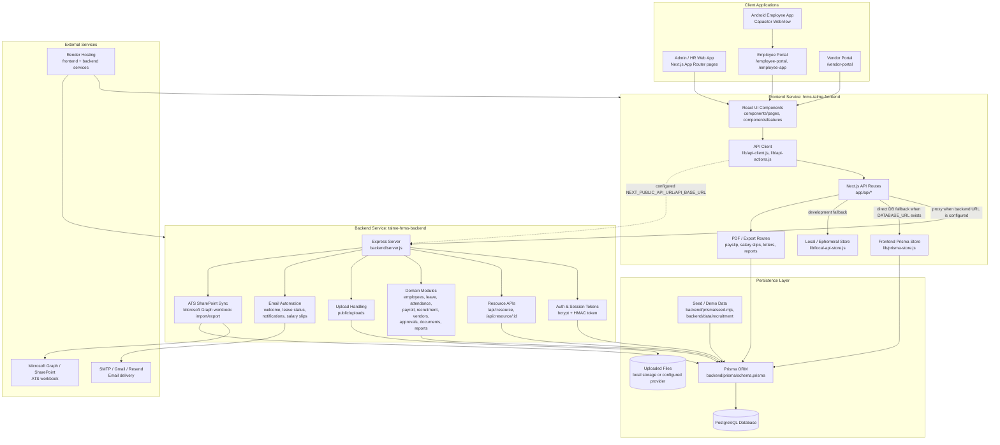
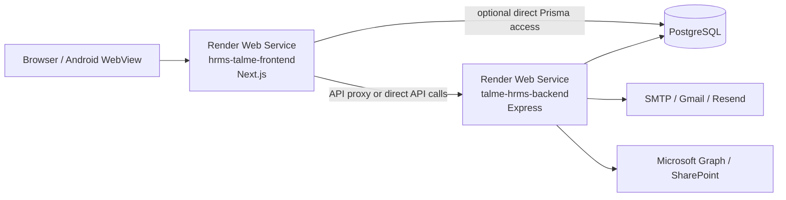

# Talme HRMS System Architecture

## Main Request Flow

1. Users access the Next.js UI through the HR/admin web app, employee portal, vendor portal, or the Capacitor Android shell.
2. UI components call `lib/api-actions.js`, which resolves API URLs through `lib/api-client.js`.
3. Requests normally hit `app/api/*` in the Next.js service.
4. Next.js API routes proxy to the Express backend when `NEXT_PUBLIC_API_URL` or `API_BASE_URL` is configured.
5. If no backend URL is configured, the Next.js routes can use `lib/prisma-store.js` with `DATABASE_URL`, or a development-only local fallback store.
6. The Express backend handles authentication, CRUD resources, dashboards, reports, payroll, uploads, notifications, and ATS SharePoint sync.
7. Prisma persists HRMS data in PostgreSQL using the models in `backend/prisma/schema.prisma`.

## Core Business Modules

- Workforce: employees, users, roles, attendance, punch activity, shifts, leave requests, documents.
- Recruitment / ATS: candidates, job openings, recruiters, harmonized roles, offers, SharePoint workbook sync.
- Payroll: salary data, payslip PDFs, salary slip sharing, payroll release and summary.
- Vendor management: vendors, vendor workers, invoices, invoice parties, vendor portal.
- Operations: approvals, notifications, settings, activity/audit logs, dashboard, reports, exports, global search.

## Deployment View

